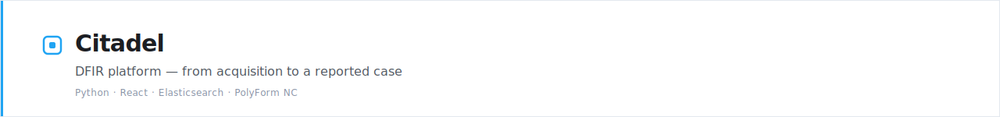
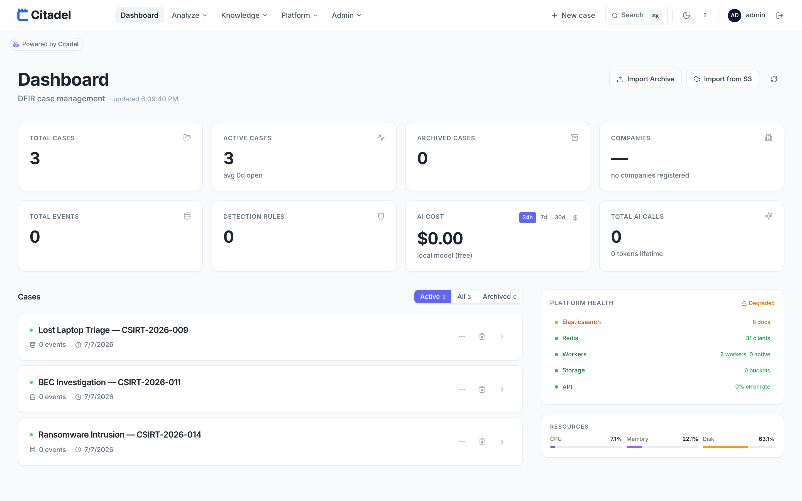
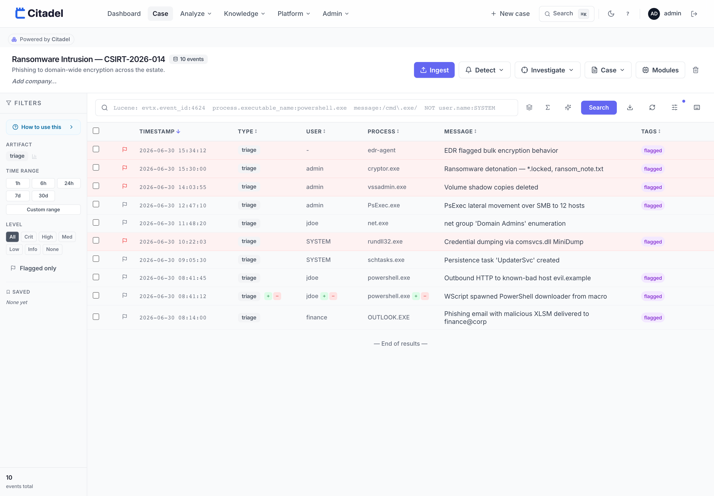
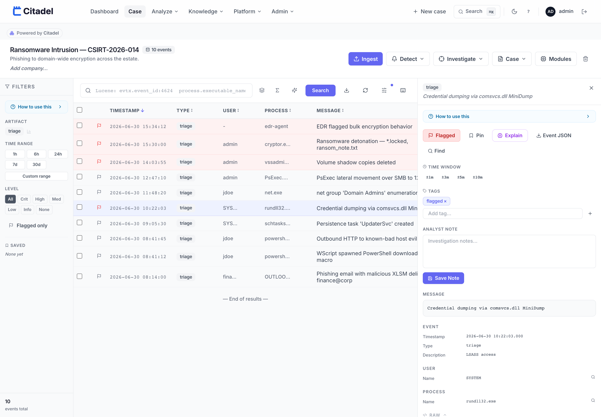
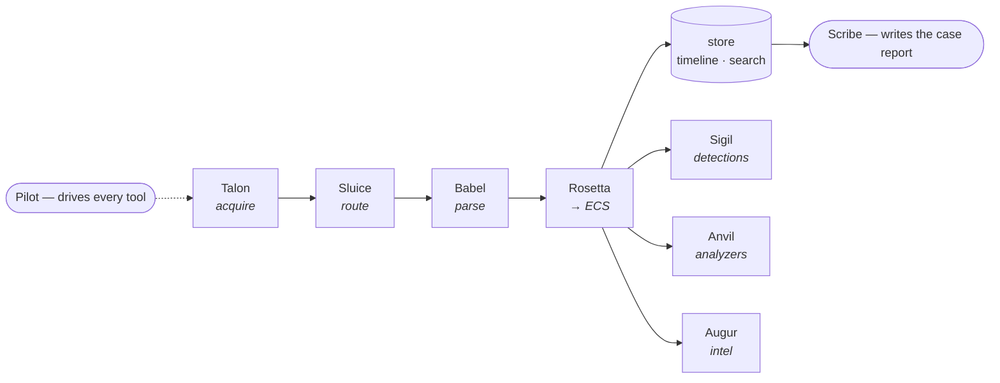

<p align="center"></p>

## Demo

**Case dashboard** — every investigation, platform health, and resource usage at a glance.

<p align="center"></p>

**Case timeline** — normalized events across the intrusion, filterable and Lucene-searchable, with flagged findings and MITRE context.

<p align="center"></p>

**Event drill-down** — flag, pin, tag, annotate, or explain any event; inspect the full record and raw JSON.

<p align="center"></p>

---

# Citadel

**A DFIR platform built from independent, standalone tools — each useful on its own, all composed by Citadel.**

[](LICENSE)
[](https://www.python.org/)
[](https://www.elastic.co/)

Citadel takes a forensic artifact from acquisition to a finished, searchable, detection-rich case — acquire → ingest → parse → normalize → detect → analyze → enrich → investigate → report. Every stage is a **standalone tool** with its own CLI; the platform wires them together over **shared contracts**.

**Open-core / source-available** under the PolyForm Noncommercial License — run, modify, and self-host for any noncommercial purpose. Premium *runtime* tiers are unlocked by a license key; no key → Community tier. See [Licensing](#licensing).

## Quickstart

`./foctl` drives every deployment — it generates secrets, creates `.env`, builds images, and sizes resources, so a first install is one command.

```bash
git clone https://github.com/sltcnb/citadel.git && cd citadel
./foctl deploy docker     # single host · or: ./foctl (interactive menu)
```

Open **http://localhost** — default login `admin` / `CitadelAdmin1!` (forced password change on first sign-in).

| Mode | Command | Best for |
|------|---------|----------|
| **Docker Compose** | `./foctl deploy docker` | laptop, single server, evaluation, air-gapped |
| **Kubernetes** (raw manifests) | `./foctl deploy k8s` | a cluster where Citadel provisions ES/Redis/MinIO |
| **Kubernetes** (new local k3d) | `./foctl deploy k8s-new` | development, CI, offline labs |
| **Helm** (app-only) | `./foctl deploy helm` | a cluster already running ES/Redis/MinIO + ingress |

**Operations** — `./foctl status` · `logs api` · `update` · `destroy` · `config` (mode auto-detected). **Prerequisites** — Docker (Compose v2); kubectl + Helm 3 for k8s/Helm modes; Python 3 for `foctl`. Helm-by-hand, ingress (`traefik`/`tailscale`/`nginx`), and Google/Microsoft SSO setup: [`docs/DEPLOY.md`](docs/DEPLOY.md).

Run any tool standalone, no platform required:

```bash
babel parse Security.evtx -o events.jsonl                 # parse one artifact
rosetta normalize events.jsonl --ecs 8.11 -o ecs.jsonl    # → ECS v8 + OSSEM
augur enrich iocs.json -o enriched.stix.json              # enrich IOCs
```

## The tool suite

Each tool is its own product (`tools/<name>`), with its own CLI and `brick.yaml` — run one alone, or adopt the platform. Full index: [`tools/README.md`](tools/README.md). Each ships a `capabilities.yaml`; Citadel **renders its UI from that declaration** (forms, options, validation) and self-registers manifests into Redis, so a tool-only change needs no orchestrator or API rebuild.

| Tool | Role | Standalone CLI |
|------|------|----------------|
| **Talon** | Acquisition agent — host/disk/mount → artifact bundle | `talon collect --out case.bundle` |
| **Sluice** | Intake & routing — bundle/file/dir → routed events | `sluice ingest case.bundle` |
| **Babel** | Parser library — artifact → `ForensicEvent` (40+ packs) | `babel parse Security.evtx` |
| **Rosetta** | Canonicalizer — `ForensicEvent` → ECS v8 + OSSEM | `rosetta normalize ev.jsonl` |
| **Sigil** | Detection engine — ECS + rules → detections | `sigil validate ./rules/` |
| **Anvil** | Analysis runner — artifact + module → findings | `anvil run volatility3 -a mem.raw` |
| **Augur** | Intel enrichment — IOCs → scored STIX / MISP | `augur enrich iocs.json` |
| **Pilot** | Investigation agent — case → autonomous report (LLM) | `pilot investigate --case ID` |
| **Scribe** | Report engine — case → HTML/PDF/Markdown/DOCX | `scribe report --case ID -f pdf` |
| **Citadel** | Platform / integrator — cases · timeline · search · console | `docker compose --profile full up` |

## Features

| Area | What |
|------|------|
| **Acquisition** | Talon live + dead-box (Windows/Linux/macOS/server); in-app Harvest from a mounted image/path; resumable encrypted upload; gRPC remote agent (mTLS) |
| **Ingestion** | 40+ parsers, 80+ forensic formats auto-detected (EVTX, MFT, Registry, Prefetch, LNK, PCAP, Plaso, syslog, Zeek, Suricata, browsers, Android/iOS, disk images) |
| **Detection** | 1 666 built-in rules (1 487 Sigma across 13 ATT&CK tactics + 179 native ES queries); Sigma→ES conversion; ATT&CK coverage matrix; runtime opt-out |
| **Analysis** | Hayabusa, RegRipper, YARA, Volatility3, capa/FLOSS, oletools, PE/strings, CTI IOC matching — typed `BaseModule` + DAG pipelines |
| **Search & normalize** | ES full-text + facets, saved queries, timeline, CSV export, cross-case search; `ForensicEvent → ECS v8` + OSSEM with GeoIP/ASN/rDNS enrichment |
| **Investigate** | Alert-triggered auto-investigation · entity graph (host↔user↔IP) · rare-artifact stacking · reverse kill-chain · cross-case Pilot memory · editable templates |
| **AI assist** | LLM providers (Anthropic, OpenAI, Ollama, OpenRouter) for the Pilot agent, rule generation, summaries; cost tracking; prompt-injection guardrails + confidence-calibrated verdicts |
| **Threat intel** | STIX/TAXII, MISP, YETI, OTX/URLhaus/AbuseIPDB/Shodan/GreyNoise; SSRF-guarded feed fetches |
| **AuthN / AuthZ** | JWT · MFA/TOTP · SSO (Google & Microsoft OIDC) · granular RBAC + role presets + groups · per-company multi-tenant isolation · tiered licensing |
| **Evidence & observability** | Tamper-evident hash-chained audit log + signed chain-of-custody manifests; structured JSON logs, Prometheus `/metrics`, `/healthz`/`/readyz` |

## Using the case console

Inside a case the top toolbar is the command surface, and everything you produce flows to **one** place — **Findings**.

| Control | What it does |
|---------|--------------|
| **Ingest** | Upload artifacts (files, bundles, disk images) or pull from S3, with live per-job progress. |
| **AI** / **⚡ Auto-AI** | Launch Pilot (reads events, detections, and Findings; runs tool-calls; writes a report). Auto-AI launches it the moment ingest finishes. |
| **Detect ▾** | Detection Rules (Sigma/EQL), Anomalies (z-score), Baseline / rare artifacts, MITRE coverage. |
| **Investigate ▾** | IOCs + threat-intel match, Process Tree, Entity graph, Kill chain, Co-Pilot. |
| **Case ▾** | Notes, Templates, Report (MD/HTML/PDF/DOCX), signed Evidence chain. |
| **Modules** | Run analysis modules (Hayabusa, YARA, CAPA, Volatility…); results land in Findings. |

**Findings** is the single output store: every surface (modules, IOC match, anomaly scan, MITRE coverage, Pilot) writes here in one shape. Filter by kind/severity, export CSV, re-ingest a selection, or pivot to source events. Findings are ordinary timeline events (`artifact_type:finding`), so they are searchable, reported, and carried in the `.citadel` archive — no separate path. A **Module run status** view tracks progress/failure/retry separately from output.

## Architecture

Citadel is an end-to-end DFIR pipeline assembled from standalone tools. Tools stay independent because they speak only **contracts** — never each other's internals.



Three shared layers make this work: **`ForensicEvent`** (what a Babel parser yields — `timestamp` + `message` + `artifact_type`; Rosetta maps it to **ECS v8 + OSSEM**), the **artifact bundle** (`manifest.json | events.jsonl | blobs/<sha256> | bundle.sha256`), and **`brick.yaml`** (every tool's manifest). The async pipeline runs over a message bus (Redis Streams default; NATS/Kafka pluggable), at-least-once, dedup by event sha256: `artifacts.received → events.parsed → events.normalized → {indexed, detections.matched, modules.completed, intel.enriched}`. Full contract: [`contracts/`](contracts/).

| Component | Tech |
|-----------|------|
| Frontend | React 18 + Vite + Tailwind (nginx) |
| API | FastAPI / Python 3.11 (Uvicorn) |
| Workers | Celery (ingest + modules queues) |
| Search | Elasticsearch 8 · **Broker/state** Redis 7 · **Artifacts** MinIO (S3) · **Ingress** Traefik |

Layout: `api/` + `frontend/` (platform) · `tools/` (standalone suite + `citadel_contracts`) · `contracts/` (schemas) · `charts/citadel/` (Helm) · `k8s/` (manifests). Resource sizing (`scripts/allocate_resources.py`) reads real host RAM/CPU and never over-commits.

## Contributing

`./scripts/run_tests.sh` runs 16 suites + a real `access.log → Babel → Rosetta → Sigil` integration, stdlib-only (no pytest/ES/Redis), enforced in CI on Python 3.11 & 3.12. **Add a parser:** scaffold from `tools/babel/template` (cookiecutter), implement `parse()`, drop the package under `tools/babel/` — the loader discovers it. **Add a tool:** new `tools/<name>/` depending only on `citadel_contracts` + `contracts/`, ship a `brick.yaml`, emit `ForensicEvent`. **Rule:** never import another tool's internals — cross only via contracts. See [`CONTRIBUTING.md`](CONTRIBUTING.md).

## Licensing

**Source-available, noncommercial.** Licensed under the **PolyForm Noncommercial License 1.0.0** ([`LICENSE`](LICENSE)) — run, modify, and self-host for any noncommercial purpose (personal, research, education, nonprofits, government). **Any commercial use requires prior written authorization signed by the copyright holder.** Premium runtime tiers (pro / enterprise / mssp) are unlocked by a license key; no key → Community tier. Detail: [`LICENSING.md`](LICENSING.md).
