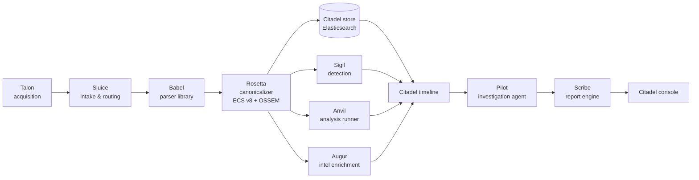
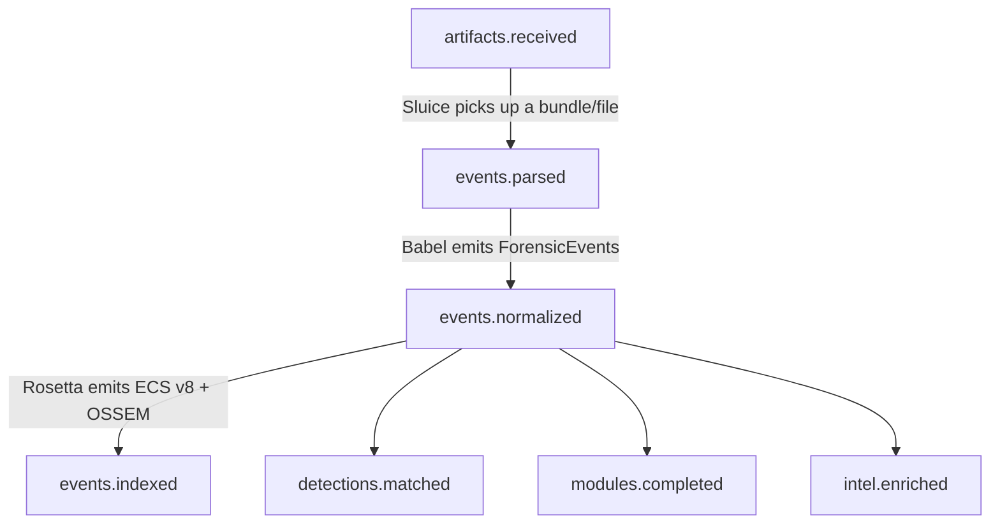

# Architecture

Citadel is an end-to-end DFIR pipeline assembled from standalone tools. Tools stay independent because they speak only [contracts](contracts.md) — never each other's internals. Synchronous request/response runs over **gRPC** (Talon ↔ Sluice, Pilot ↔ tools); the asynchronous pipeline runs over a **message bus** (Redis Streams default, NATS/Kafka pluggable).

## The pipeline



One-liner:

```
Talon → Sluice → Babel → Rosetta → {store, Sigil, Anvil, Augur} → Citadel timeline → Pilot → Scribe → console
```

## Bus topics

Asynchronous pipeline stages communicate over a message bus. Each stage is a consumer group; backpressure and replay come from stream semantics. Delivery is **at-least-once**, so consumers must be **idempotent** (dedup by event sha256 / doc id).



| Topic | Producer | Consumers | Payload |
|-------|----------|-----------|---------|
| `artifacts.received` | Talon / upload API | Sluice | bundle ref + `bundle_manifest` |
| `events.parsed` | Babel (via Sluice) | Rosetta | `forensic_event/v1` batch |
| `events.normalized` | Rosetta | store, Sigil, Anvil, Augur | ECS v8 event batch |
| `events.indexed` | Citadel store | timeline | doc ids |
| `detections.matched` | Sigil | Citadel, webhooks | detection + rule id |
| `modules.completed` | Anvil | Citadel | findings + run id |
| `intel.enriched` | Augur | Citadel | enriched IOCs (STIX) |

See `contracts/bus_topics.md` in the repo for the full contract.

## The three shared layers

Everything that crosses a tool boundary is one of three shared, versioned layers.

### 1. Canonical event — `ForensicEvent`

A Babel parser yields a `ForensicEvent` (required `timestamp` + `message`; recommended `artifact_type` + raw record). A ~90-entry artifact-type taxonomy is the routing key; structured types carry their raw record. Rosetta maps it to **ECS v8 + OSSEM** — the schema the timeline, search, Sigil, and Scribe all read. See `contracts/forensic_event.schema.json` and `contracts/ecs_extension.md`.

### 2. Artifact bundle

The portable unit Talon hands to Sluice:

```
bundle/  manifest.json | events.jsonl | blobs/<sha256> | bundle.sha256
```

`manifest.json` carries `session_id`, `hostname`, `os`, timestamps, and an `artifacts[]` list with per-file `sha256`/`size`/`category`. See `contracts/bundle_manifest.schema.json`.

### 3. Manifest — `brick.yaml`

Every tool ships a `brick.yaml` at its repo root declaring how it composes into the suite — `name`, `kind`, `version`, `consumes{content_types,filenames,schema}`, `produces{schema,artifact_types}`, `dependencies`, `health`, `status`. Standalone use never requires it. See `contracts/brick.schema.json`.

## Deployment

- **Monorepo-of-submodules** — Citadel pins each tool at a tested version.
- **Helm** — umbrella chart `charts/citadel` + per-tool subcharts; autoscale hot workers (Babel/Anvil) on queue depth.
- **Compose profiles** — `--profile edge` (Talon) | `pipeline` (Sluice+Babel+Rosetta+store) | `full` (everything).
